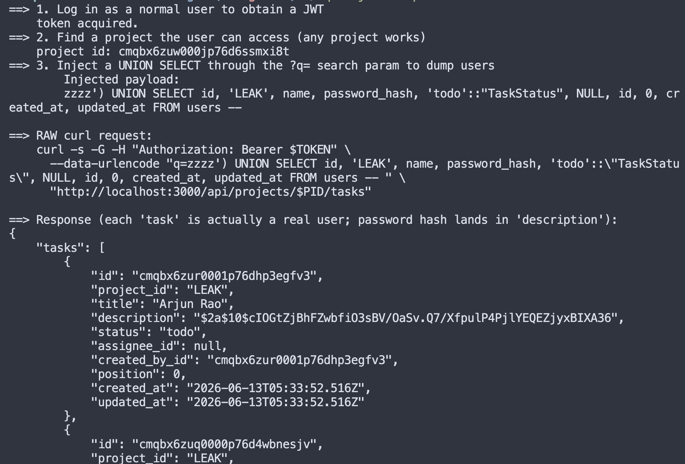
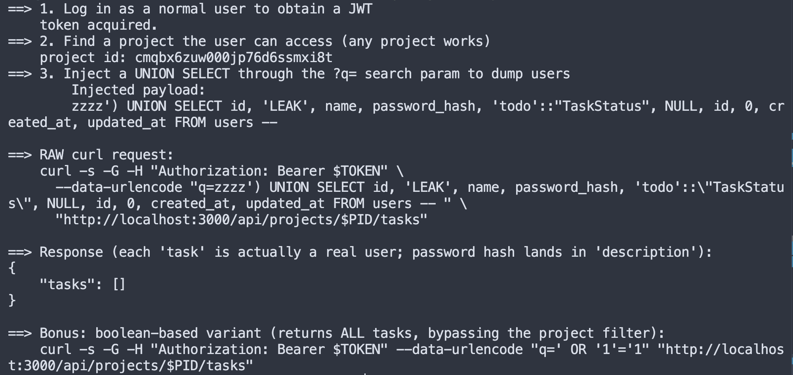
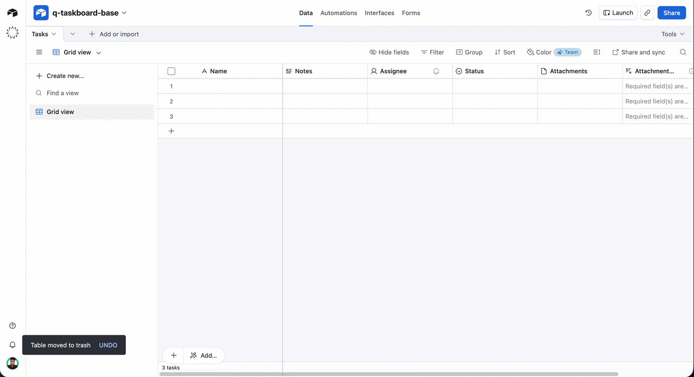
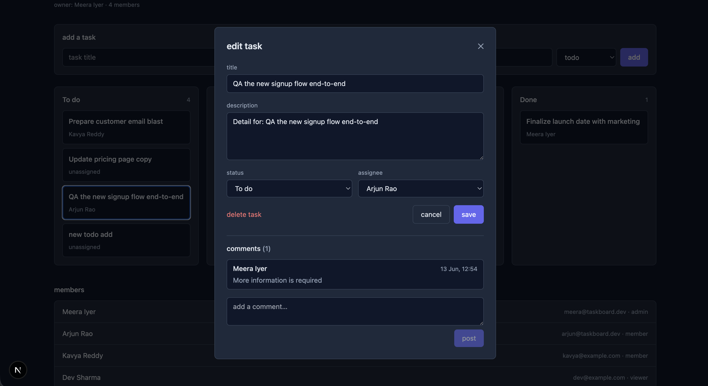
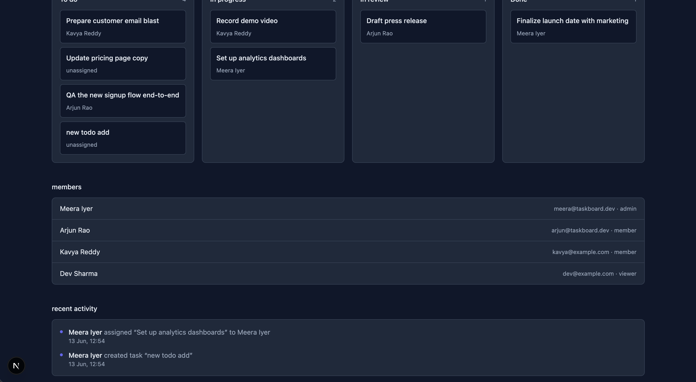

## DATABASE Seed

```
➜  q-taskboard-assessment git:(assignment) docker-compose exec web npm run db:seed

> taskboard@0.1.0 db:seed
> tsx prisma/seed.ts

seeding…
seed complete.
login with any of these (password: password123):
  meera@taskboard.dev   — admin on Q3 Launch, Internal Tools
  arjun@taskboard.dev   — admin on Onboarding, member on Q3 Launch
  kavya@example.com     — member on Q3 Launch
  dev@example.com       — viewer on Q3 Launch
  lina@example.com      — member on Onboarding
```


## Sql injection bug proof screenshot

You can clearly see that we can use union to extract password hashes of every user.




## Sql injection bug fix proof




## Airtable export demo gif

You can check out the google drive video to get more details about this




## Part 3a Proof




## Part 3b proof




## Final Test run

```
 q-taskboard-assessment git:(assignment) ✗ docker-compose exec web npm run test   

> taskboard@0.1.0 test
> vitest run

The CJS build of Vite's Node API is deprecated. See https://vite.dev/guide/troubleshooting.html#vite-cjs-node-api-deprecated for more details.

 RUN  v2.1.8 /app

 ✓ src/tests/TaskCard.test.tsx (3)
 ✓ src/tests/activity.test.ts (6)
 ✓ src/tests/airtable-export.test.ts (7)
 ✓ src/tests/auth.test.ts (2)
 ✓ src/tests/comments.test.ts (6)
 ✓ src/tests/schemas.test.ts (7)

 Test Files  6 passed (6)
      Tests  31 passed (31)
   Start at  07:29:30
   Duration  558ms (transform 202ms, setup 298ms, collect 347ms, tests 48ms, environment 1.35s, prepare 600ms)
```